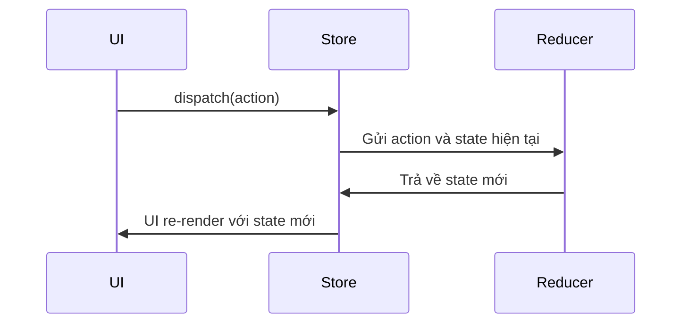

## 🧰 Công Nghệ Sử Dụng

<p align="left">
  
  
  
  
  
  
  
  
</p>

---
- **TypeScript** (97.8%)  
- **JavaScript** (1.3%)
- **HTML** (0.9%)
- **Redux**: Thư viện quản lý trạng thái trung tâm cho ứng dụng JavaScript.
- **Redux Toolkit**: Công cụ hiện đại để làm việc với Redux dễ dàng hơn.
- **React** (nếu áp dụng trong project): Kết hợp phổ biến nhất với Redux.
- **Redux DevTools**: Hỗ trợ debug và quan sát state.

---

## ⚙️ Cài Đặt Dự Án với Vite

> Yêu cầu: Node.js >= 16.x, npm hoặc yarn

### 1. 📥 Clone repository

```bash
git clone https://github.com/quangcaptain26-3/Redux-Course.git
cd Redux-Course
````

### 2. 📦 Cài đặt dependencies

```bash
npm install
# hoặc
yarn install
```

### 3. 🏁 Chạy ứng dụng ở môi trường dev

```bash
npm run dev
# hoặc
yarn dev
```

### 4. 🛠 Build Production

```bash
npm run build
# hoặc
yarn build
```

### 5. 🔍 Preview Production (sau khi build)

```bash
npm run preview
# hoặc
yarn preview
```

---

## 📚 Tổng Quan Về Redux

### 🧠 Redux là gì?

Redux là thư viện quản lý trạng thái trung tâm cho các ứng dụng JavaScript. Nó giúp đồng bộ và dự đoán trạng thái trong toàn ứng dụng theo cách có tổ chức và dễ debug.

### 🔑 3 Nguyên Tắc Chính

1. **Single Source of Truth** – Một store duy nhất chứa toàn bộ state.
2. **State là Read-only** – Chỉ thay đổi thông qua action.
3. **Thay đổi thông qua pure functions (Reducer)** – Trả về state mới mà không thay đổi trực tiếp state cũ.

### 🧩 Thành Phần Chính

| Thành phần   | Mô tả                                                 |
| ------------ | ----------------------------------------------------- |
| `Store`      | Lưu trữ toàn bộ trạng thái                            |
| `Action`     | Mô tả sự kiện để thay đổi trạng thái                  |
| `Reducer`    | Hàm thuần nhận vào state + action -> trả về state mới |
| `Dispatch`   | Gửi action đến reducer                                |
| `Selector`   | Trích xuất dữ liệu từ state                           |
| `Middleware` | Thực hiện logic phức tạp (async, log...)              |

---

## ⚡ Redux Toolkit

**Redux Toolkit** đơn giản hóa việc làm việc với Redux thông qua các API hiện đại:

* `configureStore`
* `createSlice`
* `createAsyncThunk`

---

## 🔁 Quy Trình Hoạt Động



---

## 📌 Ví dụ Cơ Bản

```ts
// actions.ts
export const increment = () => ({ type: 'INCREMENT' });

// reducer.ts
const initialState = { count: 0 };
function counter(state = initialState, action) {
  switch (action.type) {
    case 'INCREMENT':
      return { count: state.count + 1 };
    default:
      return state;
  }
}

// store.ts
import { createStore } from 'redux';
const store = createStore(counter);
```

---

## 🌐 Liên Hệ & Kết Nối

* 📄 LinkedIn: [Minh Quang](https://www.linkedin.com/in/minhquang2604)

---

## 📜 License

This project is licensed under the **MIT License**.

---

> 💡 *Hãy ⭐️ repo nếu bạn thấy hữu ích để giúp nhiều người hơn tiếp cận kiến thức về Redux!*

